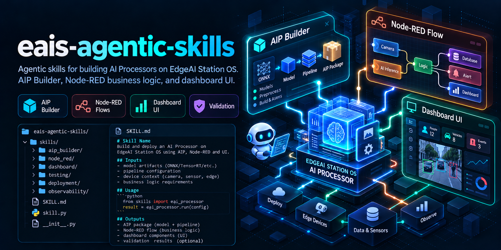

# EAIS Agentic Skills



Agentic programming skills for developing EdgeAI Station applications (AI Processors, Node-RED flows, and Dashboards).

The hero is a conceptual illustration, not a directory layout or executable API example.
This repository contains agent instructions and references, not a Python SDK or deployment service.

> **Proprietary:** This repository is not open source. Access to a public
> repository does not grant permission to use or redistribute its contents.
> See [LICENSE](LICENSE); obtain written authorization from Edgematrix Inc.
> before use or redistribution.

## Skills

| Skill | Purpose |
|-------|---------|
| [AIP Builder](skills/aip-builder/SKILL.md) | AI Processor engineering (DeepStream/Triton, callback.py, model conversion) |
| [Node-RED Flow Architect](skills/node-red-flow-architect/SKILL.md) | Business logic — AIP metadata integration, IoT logic, data analysis |
| [Node-RED Dashboard Architect](skills/node-red-dashboard-architect/SKILL.md) | UIBuilder web applications (Vue3 dashboards) |

The developer skills compose as **AIP → Flow → Dashboard**. See
[composition.md](skills/aip-builder/resources/composition.md) for the data contract between layers.

## Which skill should I use?

| If the task is about… | Use this skill | Typical handoff |
|---|---|---|
| `callback.py`, `manifest.json`, `options.json`, TensorRT, Triton, model conversion, AIP packaging, or pipeline performance | [AIP Builder](skills/aip-builder/SKILL.md) | Document the `merge_and_analyze()` output before handing off to Flow Architect |
| Flow JSON, callback wiring, JSONata, alarms, monitoring, EAIS nodes, or MS2/MS3 API requests | [Node-RED Flow Architect](skills/node-red-flow-architect/SKILL.md) | Capture the complete callback message before handing UI data to Dashboard Architect |
| UIBuilder source, Vue3, browser bindings, layout, or dashboard behavior | [Node-RED Dashboard Architect](skills/node-red-dashboard-architect/SKILL.md) | Consume an observed message shape; return flow changes to Flow Architect when wiring changes |

An agent may select installed skills from the task wording and frontmatter descriptions. Installation
alone does not prove activation: discovery and explicit invocation differ between agents and versions.
Ask the agent to load the skill by name and check its skill-load/tool trace when available:

```text
Use the aip-builder skill to develop this callback.py.
Use the node-red-flow-architect skill to wire its output into Node-RED.
Use the node-red-dashboard-architect skill to build the UIBuilder dashboard.
```

For an end-to-end request, load them in order: AIP Builder, then Flow Architect, then Dashboard
Architect. An agent that cannot load a named skill should report that limitation rather than imply
the skill was used. Automatic routing has not yet been evaluated across supported agents.

## Prerequisites and access

- Installing the instructions does not require access to platform source repositories.
- Building and testing an AIP requires a compatible EdgeAI Station and an engineering license
  providing development-tool access. AIP runtime licensing is separate from this repository's
  proprietary terms. See the station's licensing documentation or contact your station supplier for access.
- Flow and dashboard deployment require authorized access to the station's Node-RED editor and
  installed EAIS nodes; dashboards use UIBuilder and a locally installed Vue 3 library.
- Without a station, the agent can draft code and inspect supplied exports. Runtime behavior,
  performance, message shapes, and deployment remain unverified until tested on the target station.

## Optional: live device access

Once installed, the bundled instructions and references can be read offline. Installing packages,
looking up external documentation, and testing a station may require additional access.

An optional EAIS MCP integration (`eais-gateway-mcp`) can read live station state — registered AIPs,
pipeline status, media, logs and metrics — to ground output in real identifiers instead of placeholders.
No MCP setup is required to use these skills. If the integration is unavailable, use supplied exports and
redacted logs, and label assumptions explicitly.

The MCP is **read-only**: it cannot deploy flows, write dashboard source, or build an AIP. Each skill
carries its own `resources/eais-mcp-usage.md` describing the tools, limits, and fallbacks.

## Installation (authorized users)

The installation commands below are for users authorized in writing by Edgematrix Inc.
The skills CLI can copy repository contents into an agent's local environment; that
installation does not grant permission to use or redistribute the materials.

Install with the [skills.sh](https://www.skills.sh/) CLI (recommended):

```bash
npx skills add edge-ai/eais-agentic-skills
```

This auto-detects your installed agents (Claude Code, GitHub Copilot, Codex, Cursor, Windsurf, …) and installs all three included skills into each agent's native skills directory. Pull the latest versions later with `npx skills update`.

See [docs/deployment.md](docs/deployment.md) for alternative installation methods (git submodule and direct clone).

### Supported Platforms

This repository works with any agentic coding environment supported by the skills CLI. The CLI detects installed agents and places each self-contained skill in the agent's native skills directory.

## Structure

Each skill directory is self-contained — everything a skill references lives under its own `resources/`, so it still resolves after `npx skills add` installs it standalone.

```
├── CHANGELOG.md                       # Version history & platform compatibility
├── LICENSE                            # Proprietary terms; no general reuse grant
├── .gitignore
├── assets/
│   └── eais-agentic-skills-hero.png    # conceptual repository illustration
├── skills/
│   ├── aip-builder/
│   │   ├── SKILL.md
│   │   └── resources/                 # developer-guide/, composition.md, eais-mcp-usage.md
│   ├── node-red-flow-architect/
│   │   ├── SKILL.md
│   │   └── resources/                 # endpoint indexes, OpenAPI specs, context7-usage.md, eais-mcp-usage.md
│   └── node-red-dashboard-architect/
│       ├── SKILL.md
│       └── resources/                 # STARTING_GUIDE.md, composition.md, context7-usage.md, eais-mcp-usage.md
└── docs/
    └── deployment.md                  # Installation methods
```
