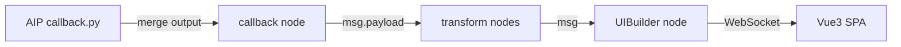

# Skill Composition: AIP → Flow → Dashboard

This document describes how data flows through the three EAIS skills end-to-end.

## Architecture



## Ownership and variability

Do not treat a captured message or reference flow as a package-version contract.
Before writing any transform, binding, or alarm rule, identify which layer owns the
data and verify the target station at runtime:

| Part of `msg` | Produced by | What to assume |
|---------------|-------------|----------------|
| `msg.payload` content | AIP callback | Free-form; `merge_and_analyze()` defines one merge result |
| `msg.payload` envelope | MS3 merge/push delivery | May be a direct probe result, direct merge result, or a batch of time-windowed merge records |
| `msg.eais` | Node-RED callback node | Node-added operational context; exact fields may evolve |
| `msg.metadata` | Optional Node-RED enrichment | May be absent when disabled or when enrichment is unavailable; exact fields may evolve |

> 🚨 **Important**: There is no canonical callback message shape. The AIP developer
> controls result content, MS3 controls merge/push delivery, and the installed
> Node-RED node may parse or enrich what it receives. Any example in this repo is
> illustrative of one AIP and one pipeline configuration.

### Inspect a live message before writing bindings

Do this first, every time, rather than assuming a shape:

1. Wire a `debug` node to the `callback` node output.
2. Set the debug node to output the **complete msg object** (not just `msg.payload`).
3. Save / deploy, then read one real message in the Debug panel.
4. Write transforms and bindings against **that** observed shape.
5. Code defensively for what you did not observe — optional chaining, existence checks,
   and a fallback branch for an unexpected shape.

If no live device is available, state the assumed shape explicitly in your output so
the user can correct it.

## Stage 1: AIP `merge_and_analyze` → callback node

The AIP's `merge_and_analyze()` return value defines one merge result. MS3 may publish
that result directly or wrap multiple results according to the pipeline's merge/push
configuration. The callback requirements are:

- It must be **JSON-serializable** (no numpy arrays, sets, or custom objects)
- It must be returned within the merge window, or the push is skipped

Everything else — keys, nesting, whether object counts are keyed by class *name* or by
class *index*, whether analytics results are included — is the AIP developer's choice.
Two AIPs on the same device can emit completely different structures.

**Illustrative only** (one sample AIP, aggregating per source):

```json
{
  "0": {
    "source_id": 0,
    "obj_counter": {
      "person": { "max_val": 5, "min_val": 2, "mean_val": 3.4 }
    }
  },
  "1": { "...": "..." }
}
```

## Stage 2: callback node → Node-RED flow

The callback node subscribes to MS3 output and forwards what it receives. Depending on
the installed node and its configuration, serialized JSON may be parsed into an object
or left as a string. The node also adds operational context and can optionally enrich
the message with pipeline metadata:

```
msg.payload  = callback data observed on this station (object, array, or string)
msg.eais     = node-added operational context
msg.metadata = optional enrichment; it can be absent even when requested
```

When metadata is available, it commonly includes pipeline, AIP, media-source, and
class-label information. Use only fields observed in a live message or documented by
the installed node's editor help.

For an illustrative example, see the Dashboard Architect skill's
`resources/STARTING_GUIDE.md` — again, one AIP and one pipeline configuration.

For a keyed `obj_counter.person.max_val` contract, the Flow Architect resource
`resources/jsonata-cheatsheet.md` provides a tested adapter. Load it before
inventing a normalization expression. Dynamic object keys require `$lookup`;
brackets perform filtering. Parse string JSON with a JSON node, not `$eval`.
Test direct, latest-window, empty, singleton, multiple-source and malformed
inputs. Preserve unknown measurements instead of sending zero to an alarm.
An Inject configuration contains the payload body, not the full `msg` envelope.

For an importable two-source example, load Flow Architect's
`resources/people-count-flow.json` and `resources/people-count-flow.md`, then
Dashboard Architect's `resources/people-count-dashboard.js` and
`resources/people-count-dashboard.html`. They share numeric IDs 0 and 1 and a
complete `obj_counter.person.max_val` snapshot. Missing primary/person inference
is unavailable, not zero. The flow tags count arrays before Split and source
alarm results afterwards; Catch is an independent error source, never an input
target. Trace actual exported wires and execute the actual Inject payloads.

## Stage 3: Node-RED → UIBuilder (browser)

Wire the callback node (or a transform node) to the UIBuilder node. In the Vue3 app:

```javascript
uibuilder.onChange("msg", (msg) => {
  // msg.payload  — AIP-defined, delivery-dependent: guard before indexing
  // msg.metadata — optional; enrichment may be disabled or unavailable
});
```

Guard object, array, and string cases rather than assuming, e.g.:

```javascript
const entries = Array.isArray(msg.payload)
  ? msg.payload
  : msg.payload && typeof msg.payload === "object"
    ? Object.values(msg.payload)
    : [];
```

## Skill Loading Order for End-to-End Tasks

When building a complete AIP + Flow + Dashboard solution, load skills sequentially:

1. **AIP Builder** — Define the data contract (`merge_and_analyze` output shape)
2. **Node-RED Flow Architect** — Wire callback → transforms → UIBuilder, add alarm/monitor logic
3. **Node-RED Dashboard Architect** — Build the Vue3 visualization consuming the data

Because the AIP defines result content and MS3 defines delivery, decisions made in
step 1 constrain steps 2 and 3. When the AIP is not yours, treat step 1 as an
*observation* step: inspect a live message.
