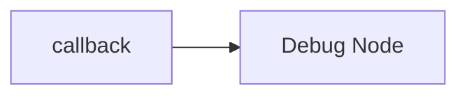
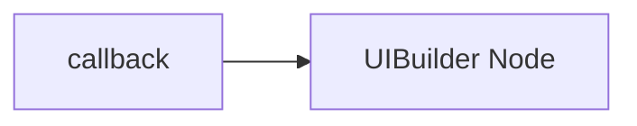

# EAIS Dashboard Starting Guide

A simple step-by-step tutorial to create your first EAIS dashboard using Node-RED and UI Builder.

## 1. About UI Builder

UI Builder is a powerful Node-RED node that allows you to create custom user interfaces and dashboards without the limitations of the built-in dashboard nodes. It provides a flexible framework for building modern web applications that can display real-time data from your Node-RED flows.

### 1.1. Key Features

- **Framework flexibility**: Supports multiple front-end frameworks including Vue.js, React, vanilla JavaScript, and more
- **Real-time communication**: Seamless bidirectional communication between Node-RED and your UI
- **No build step required**: Get started quickly with simple HTML, CSS, and JavaScript
- **Template system**: Pre-built templates to accelerate development
- **Customizable**: Full control over styling, layout, and functionality

### 1.2. Learning Resources

To learn more about UI Builder and its capabilities, explore these resources:

- **[Node-RED Flow Library](https://flows.nodered.org/node/node-red-contrib-uibuilder)**: Official UI Builder node page with installation instructions and community examples
- **[Official Documentation](https://totallyinformation.github.io/node-red-contrib-uibuilder/#/)**: Comprehensive documentation covering installation, configuration, and advanced usage patterns

These resources provide extensive examples, tutorials, and best practices for creating sophisticated dashboards and user interfaces with UI Builder.

---

## 2. Node-RED Flow Setup

### 2.1. Prerequisites

Before creating a dashboard, ensure you have:

- A running pipeline with an AI processor selected.
- UIBuilder's ESM client and Vue installed locally through its Libraries settings.
  These are separate dependencies: finding UIBuilder does not prove Vue is present.
  With approval for the dashboard target, verify both import URLs shown below
  return JavaScript from that dashboard's actual base path. A package file on disk
  alone does not prove its vendor URL is served. Report missing libraries or routes
  explicitly; do not fall back to a CDN or claim browser validation from stub tests.

### 2.2. Connect the callback node

1. Open the **Node-RED Editor** from the left sidebar menu.
2. In the Node-RED editor, drag the **callback** node from the Edgematrix section of the palette into your workspace.
3. Double-click the node to configure it — select the target **pipeline** from the dropdown list.

### 2.3. Verify data with a debug node

> **Note:** You must save your changes (click the **Save** button in the top-right corner) before data will flow through the nodes.

To verify that data is arriving from the AI processor, connect a **debug** node to the callback node:



Once saved, activate the debug node by clicking its toggle switch, then open the **Debug** panel (bug icon in the right sidebar). You should see real-time messages arriving from the pipeline.

**Illustrative example** (synthetic identifiers; one possible AIP and pipeline configuration):

```json
{
  "payload": [
    {
      "source_id": 0,
      "frame_num": 157276,
      "num_obj_meta": 20,
      "ntp_timestamp": 1773400095854007000,
      "obj_counter": [20, 0, 0, 0],
      "objInROIcnt": { "north part": 16 },
      "objLCCurrCnt": { "exit": 0 }
    },
    {
      "source_id": 1,
      "frame_num": 157271,
      "num_obj_meta": 20,
      "ntp_timestamp": 1773400095855485000,
      "obj_counter": [20, 0, 0, 0],
      "objInROIcnt": {},
      "objLCCurrCnt": {}
    }
  ],
  "eais": {
    "ok": true,
    "node": "callback",
    "command": "subscribe",
    "pipelineId": "EXAMPLE_PIPELINE_ID",
    "timestamp": "2026-03-13T11:08:15.967Z"
  },
  "metadata": {
    "pipeline": {
      "uuid": "EXAMPLE_PIPELINE_ID",
      "name": "demo"
    },
    "aip": {
      "uuid": "AIPV1XXX0001",
      "name": "Smart City reference application",
      "version": "6.2.1"
    },
    "mediaSources": {
      "0": { "uuid": "EXAMPLE_MEDIA_ID_1", "name": "sample video 1", "type": "file" },
      "1": { "uuid": "EXAMPLE_MEDIA_ID_2", "name": "sample video 2", "type": "file" }
    },
    "classLabels": { "0": "car", "1": "bicycle", "2": "person", "3": "road_sign" },
    "timestamp": "2026-03-13T11:08:15.967Z"
  }
}
```

In this illustrative message:

- **`payload`** is an array of per-source detection results. This AIP includes
  `obj_counter`, `objInROIcnt`, and `objLCCurrCnt`; another AIP may not.
- **`metadata`** contains optional enrichment such as media sources, AI Processor
  details, and class labels. It can be absent when enrichment is unavailable.
- **`eais`** contains node-added operational context.

Do not use this example as a schema. Inspect the complete live message from the
target pipeline before implementing dashboard bindings.

### 2.4. UIBuilder node setup

Now set up the UIBuilder node to create a user dashboard:

1. Drag and drop the **UIBuilder** node from the palette into your workspace.
2. Double-click the UIBuilder node to configure it. Set the **URL** (used in the dashboard address) and **Name** for the dashboard.
3. Connect the callback node to the UIBuilder node:



### 2.5. Set dashboard for user

To make the dashboard accessible:

1. Navigate to the **Accounts management** page.
2. Assign the dashboard to yourself or to any other user.
3. Once assigned, access the dashboard by clicking the dashboard hyperlink in the accounts page or by clicking the **"Dashboard"** button on the left side panel.

## 3. Web Application Development with UI Builder

### 3.1. Add front-end templates (Vue3)

To create a dashboard using the UIBuilder node in Node-RED, you can follow these steps to set up a Vue3 template that will display messages received from the callback node.

1. In the UIBuilder node configuration, you can select a front-end template. Navigate to: **Properties > Core > Template Settings** and select the **Minimal template (default)**. This template uses the ESM client which supports modern JavaScript module imports required for Vue3.

2. **Install Vue as a library**: In the UIBuilder node configuration pane, go to the **Libraries** tab. In the **Installed Packages** list, add the `vue` package. This installs Vue locally so it can be imported from the UIBuilder vendor path. This is required for on-premise deployments without internet access.

3. You can use the `msg.payload` data from the callback node to populate the dashboard.
4. Now navigate to your UIBuilder node configuration pane `Files` tab to verify the content.
5. You will find a folder named `src` containing the `index.html` and `index.js` files where you can add your front-end code.
6. You can use the following template to get started with displaying messages received from the callback node.

> **Note:** You will need to refresh the dashboard page to see the changes made.

### 3.2. Create the necessary files

**index.html:**

Replace the entire content of `index.html` with the following. The `<head>` section with `<script type="module">` is **required** for ESM imports to work in `index.js`.

```html
<!doctype html>
<html lang="en"><head>

    <meta charset="utf-8">
    <meta name="viewport" content="width=device-width, initial-scale=1">

    <title>EAIS Dashboard - Node-RED uibuilder</title>
    <meta name="description" content="EAIS Dashboard using Node-RED uibuilder">
    <link rel="icon" href="./images/node-blue.ico">

    <!-- Your own CSS (optional) -->
    <link type="text/css" rel="stylesheet" href="./index.css" media="all">

    <!-- Load index.js as a module — this is required for ESM imports -->
    <script type="module" async src="./index.js"></script>

</head><body class="uib">
  <div id="app">
    <div
      style="margin: 20px 30px; height: calc(100vh - 40px); display: flex; flex-direction: column;"
    >
      <div
        style="display: flex; justify-content: space-between; align-items: center; margin-bottom: 10px; flex-shrink: 0;"
      >
        <h2>Messages received {{messages.length}}</h2>
        <button
          @click="clearMessages"
          style="padding: 5px 10px; background-color: #ff6b6b; color: white; border: none; border-radius: 3px; cursor: pointer;"
        >
          Clear Messages
        </button>
      </div>

      <div
        v-if="messages.length === 0"
        style="padding: 20px; text-align: center; color: #666; font-style: italic; flex: 1; display: flex; align-items: center; justify-content: center; border: 1px solid #ddd; border-radius: 5px;"
      >
        No messages received yet. Send a message from Node-RED to see it here.
      </div>

      <div
        v-else
        style="border: 1px solid #ddd; border-radius: 5px; overflow: hidden; display: flex; flex-direction: column;"
      >
        <pre
          style="margin: 0; padding: 15px; white-space: pre-wrap; word-wrap: break-word; font-size: 14px; line-height: 1.4; overflow-y: auto; flex: 1; font-family: 'Courier New', monospace;"
        >
{{ formattedMessages[0].formattedPayload }}</pre
        >
      </div>
    </div>
  </div>

  <script nomodule>
    document.getElementById("app").innerHTML =
      "Your browser doesn't support JavaScript modules :(";
  </script>

</body></html>
```

**index.js:**

Replace the entire content of `index.js` with the following:

```javascript
import "../uibuilder/uibuilder.esm.min.js"; // Adds `uibuilder` and `$` to globals

// For Vue v3 — installed locally via UIBuilder Libraries tab (no build step required)
import { createApp } from "../uibuilder/vendor/vue/dist/vue.esm-browser.js";

const app = createApp({
  // Define Vue reactive variables
  data() {
    return {
      message: "Hello Vue!",
      count: 0,
      input1: "",
      messages: [], // Array to store incoming messages
    };
  },

  // Dynamic data
  computed: {
    formattedMessages() {
      return this.messages.map((msg) => {
        let objCounters = [];

        if (Array.isArray(msg.payload)) {
          // Get only the last item in the payload data
          const lastItem = msg.payload[msg.payload.length - 1];
          if (lastItem && lastItem.data && typeof lastItem.data === "object") {
            Object.keys(lastItem.data).forEach((sourceId) => {
              const source = lastItem.data[sourceId];
              if (source && typeof source === "object" && source.obj_counter) {
                objCounters.push({
                  source: sourceId,
                  obj_counter: source.obj_counter,
                });
              }
            });
          }
        }

        return {
          ...msg,
          formattedPayload:
            objCounters.length > 0
              ? JSON.stringify(objCounters, null, 2)
              : JSON.stringify(msg.payload, null, 2),
        };
      });
    },
  },

  // Supporting functions
  methods: {
    doEvent(event) {
      uibuilder.eventSend(event);
    },

    clearMessages() {
      this.messages = [];
    },
  },

  // Lifecycle hooks
  mounted() {
    // If msg changes - msg is updated when a standard msg is received from Node-RED
    uibuilder.onChange("msg", (msg) => {
      if (!msg || typeof msg !== "object" || Array.isArray(msg)) {
        console.warn("Ignored malformed UIBuilder message");
        return;
      }
      // Add message to the beginning of the array
      this.messages.unshift({
        ...msg,
      });
      if (this.messages.length > 100) this.messages.length = 100;
    });
  },
});

app.mount("#app");
```